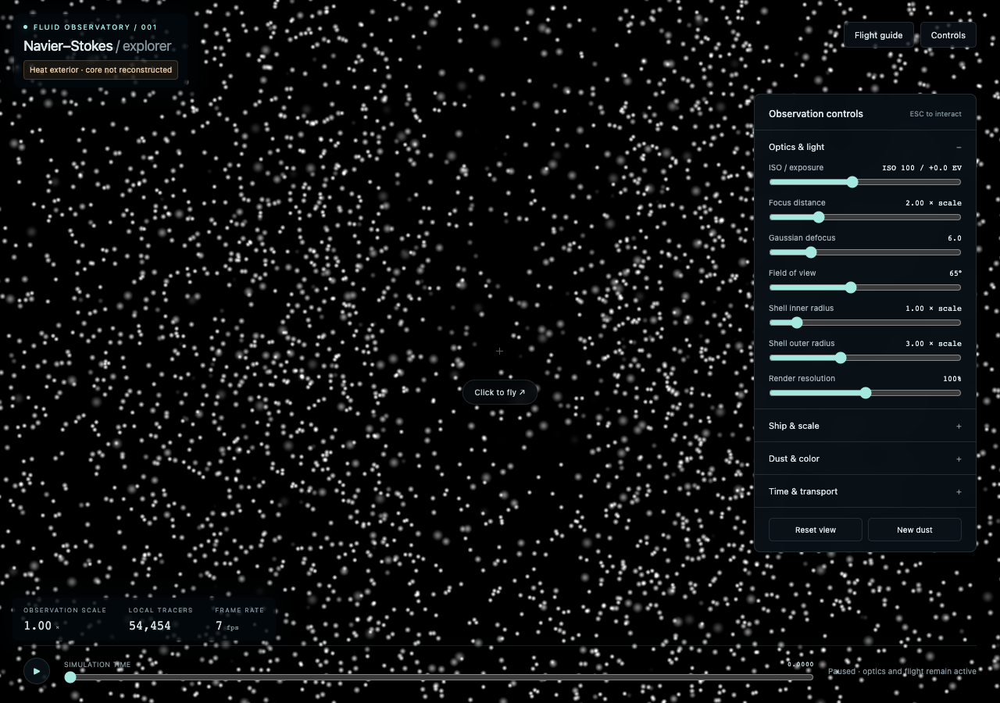

# NavierStokes

Explore a concentrating fluid vortex from a freely moving, resizable spacecraft. Luminous dust reveals the flow; the spacecraft moves independently of it. Precomputed scientific fields supply the motion, and a WebGL 2 viewer renders the experience in the browser.

**Status: first experimental implementation.** A working WebGL 2 viewer now samples a small precomputed **heat-exterior field** from Appendix A of the paper. The contracting core and full blowup construction have **not** been reconstructed. This is a source-based numerical checkpoint and an interactive optics/navigation prototype, not a visualization of a completed blowup simulation.

## Run locally

Requires Node.js 22.12 or newer and Python 3.10 or newer. The small preview dataset is checked in; generating it is optional for playback.

```sh
npm ci
npm run dev
```

Open the local URL printed by Vite. The viewer starts paused. Press play to run synchronized tracers, or enable **Independent dust transport** to see movement through a frozen field. Use **Click to fly**, then Escape to return to the controls.

```sh
npm run data:preview       # Regenerate the ~54 KB reference dataset
npm run test:science       # Numerical and dataset checks
npm run build             # Type-check and produce the static dist/ site
npx playwright install chromium
npm run test:browser      # WebGL, controls, integrity, and light tests
```

`npm run preview` serves the production build locally. The application uses relative asset URLs so the static build can be served under a repository subpath. A hosted website has not yet been deployed.

## What is implemented

- A reproducible, standard-library Python reference for the paper's isolated exterior heat-flow family, with pressure evaluation and numerical checks.
- A checksum-verified 2,049-sample profile table, reconstructed into Cartesian velocity in the browser. No full 3D time-volume download is required.
- GPU tracer integration and local particle recycling; local-axis spacecraft movement, roll, and multiplicative scale.
- Adjustable perspective, shell distances, focus, Gaussian blur, ISO, density, color, and time/dust controls.
- Linear HDR lights and bounded multiscale redistribution of excess luminance, with a visible residual-overexposure indicator.

See [the mathematical specification](docs/mathematics.md) and [scientific validation report](docs/validation/science-preview.md) for the actual represented equations and errors. The preview is pure azimuthal motion on a chosen annulus. It does not contain inward collapse, matching to the core, the corrective disturbances, localization, or startup from rest. Empty regions outside the dataset are not stationary fluid.

The current renderer is a prototype: particles do not retain global identities, large changes reseed the local population, and half-float light buffers introduce measurable rounding. The browser reports excess brightness that cannot be redistributed within the bounded pass budget. Manual exposure never changes automatically.



## Scientific purpose

The project is motivated by OpenAI's September 8, 2026 post, [On the Navier–Stokes Millennium Prize Problem](https://openai.com/index/navier-stokes-solution/), and the accompanying [Finite Time Blowup for Navier–Stokes paper](https://cdn.openai.com/pdf/32d9f210-8b73-45e0-91bc-82a30aef8a9a/navier-stokes.pdf). The authors describe a forced incompressible flow with finite-time velocity blowup and bounded kinetic energy. The accompanying [Lean formalization repository](https://github.com/openai/NavierStokesAndEuler) is a reference, not a dependency of the planned viewer.

The next scientific target is to reconstruct the paper's **leading-flow approximation**, subject to the remaining feasibility work. The complete construction includes oscillatory disturbances and corrections essential to its forcing properties. A visualization of the leading flow must not be presented as a reproduction or verification of that complete result. The current exterior checkpoint is a smaller component of that target.

We will compute and explore a finite, resolved interval before the singular time. A finite dataset cannot contain an actual infinity. The viewer will disclose the represented model, valid domain, time interval, and resolution limits.

## The experience

- Fly in all directions with no fixed up direction, horizon lock, or automatic leveling.
- Shrink or enlarge the ship's observation scale and explore the same flow at different sizes.
- See luminous dust against a dark background, with ordinary finite-distance perspective.
- Observe a spherical visibility shell, initially from **1× to 3× ship scale**, focused at **2×**.
- Adjust field of view, visibility distances, focus, Gaussian defocus, ISO/exposure, and particle density independently.
- Play, pause, change speed, or scrub simulation time.
- Optionally move dust through a frozen velocity field, or change its speed independently of simulation playback.
- Start with white lights; optionally map speed from blue to red and distance to saturation.

Only dust in the observation shell and a small hidden buffer is simulated. Particles outside that region are recycled. The fluid field stays consistent, but revisiting a location does not guarantee seeing the same individual tracers.

### Proposed controls

| Input | Action |
| --- | --- |
| Mouse, while captured | Local yaw and pitch |
| W / S | Forward / backward |
| A / D | Strafe left / right |
| R / F | Local up / down |
| Q / E | Roll left / right |
| Z / X | Shrink / enlarge |
| Shift | Temporary movement boost |
| Space | Play / pause |
| Escape | Release mouse and interact with the interface |

Controls are provisional and will be tuned during use. Position, orientation, and positive observation scale are independent state. Movement uses the ship's local axes; scaling is multiplicative. Changing observation scale initially keeps the ship's position fixed and scales its travel speed and observation distances.

All optical controls will be available in a panel. Later coupling presets may coordinate scale, travel speed, viewing distance, and field of view, including a dolly zoom around a selected target.

### Light and exposure

Each particle has a normalized screen-space Gaussian light profile. Distance from the spherical focus shell determines its width. Increasing blur spreads the light without increasing its integrated brightness.

The FOV control is **horizontal**, initially 65°. The renderer accounts for the unequal solid angle covered by perspective pixels when converting tracer light to image brightness. This removes a camera-centered brightening of a uniform dust shell without changing particle positions or warping the perspective. Blur conserves each particle's light after that conversion. See [the projection calibration](docs/validation/projection.md).

Particle light is accumulated in a linear HDR image. Manual ISO/exposure multiplies that light. When pixels exceed display capacity, their excess luminance is redistributed to nearby pixels as white light. This redistribution must conserve represented light within measured numerical tolerances; it is not an additive bloom effect.

An image brighter than the capacity of the entire display cannot be preserved through spreading alone. Manual exposure remains under user control, and unresolved overexposure must be reported. Physical radiance conservation and subjective perceived brightness are different quantities.

Increasing particle density initially increases total light because per-particle brightness remains constant. An optional density-compensation setting can approximately preserve overall brightness when density changes.

## Architecture and budgets

1. **Offline generator:** Python, double-precision profile construction, diagnostics, and compact dataset export.
2. **Hosted data:** versioned manifests and compressed chunks, exploiting validated axisymmetry and similarity coordinates where applicable.
3. **Browser:** TypeScript and WebGL 2, GPU field sampling and local dust transport, Gaussian rendering, and exposure redistribution.

The browser evaluates and interpolates the precomputed representation. It does not solve the full Navier–Stokes problem during playback. No application server is needed for the planned static site.

| Constraint | Initial target |
| --- | --- |
| Generation machine | Apple M3 Pro, 36 GB RAM |
| Early preview dataset | Below 5 MB transferred |
| Full high-resolution dataset | At most 100 MB total across all shipped data chunks |
| Final generation run | Approximately one hour maximum on the generation machine |
| Primary viewer | Desktop browsers, initially benchmarked in Safari and Chromium on that Mac |
| Startup | Coarse data first; additional detail fetched on demand |

The budget applies to the dataset, not a promise of a particular scientific accuracy. Benchmarking and error measurements will determine achievable resolution. Development and small validation runs are separate from the final generation-run budget.

## Plan and project layout

See [IMPLEMENTATION_PLAN.md](IMPLEMENTATION_PLAN.md) for the milestones, mathematical feasibility checkpoint, data contract, rendering design, and acceptance criteria.

The proposed implementation layout is:

```text
science/       Profile construction, reference evaluation, validation, export
web/           Controls, field sampling, particle transport, WebGL rendering
datasets/      Dataset schema and small preview fixtures
docs/          Mathematical specification, decisions, validation reports
```

The implementation currently lives in `science/` and `web/src/`; the checked-in preview is under `web/public/datasets/`. Mathematical documentation and reports are under `docs/`. The future `datasets/` schema directory and full correction layers remain planned. Full high-resolution datasets will be distributed as hosting artifacts rather than routinely committed into source history. Hosting and the project's own code license remain open decisions.

## Planning skill

The repository includes Matt Pocock's [grill-me skill](https://www.aihero.dev/skills-grill-me), plus its required `grilling` dependency, under [`.agents/skills`](.agents/skills). Use it explicitly to question assumptions and clarify decisions before implementation.

In Codex, invoke `$grill-me` or select it through the skills interface. Hosts that support the upstream slash command can use `/grill-me`. Codex discovers repository skills in `.agents/skills`; see the [official skill documentation](https://learn.chatgpt.com/docs/build-skills). Newly installed skills should be available on the next turn; restart the agent if discovery has not refreshed.

The upstream skill files are unmodified. [AGENTS.md](AGENTS.md) supplies the invocation fallback for hosts without a literal `Skill` tool. [THIRD_PARTY_NOTICES.md](THIRD_PARTY_NOTICES.md) records the source revision and MIT license. Installing the skill does not automatically start an interview.
