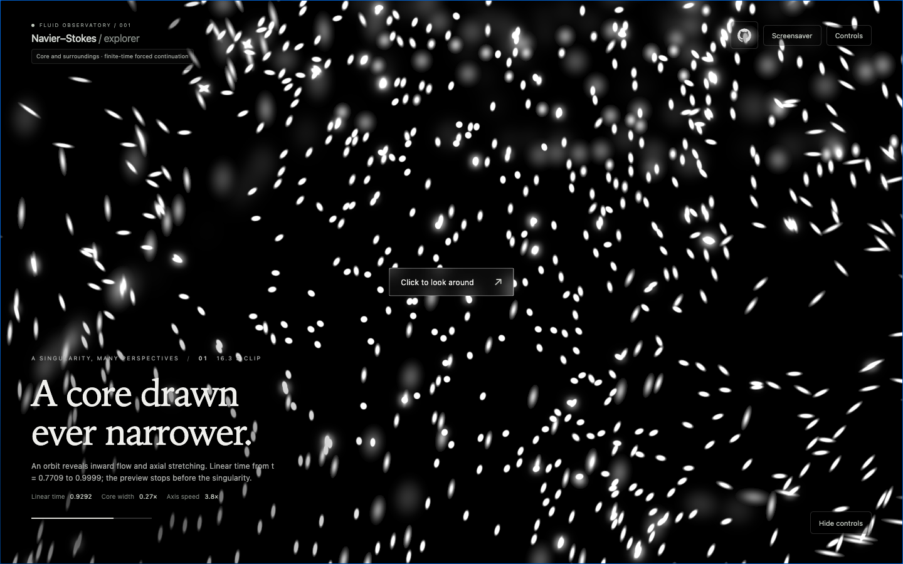

**[Enter the observatory →](https://navierstokes.kanhar.art/)**

# Navier–Stokes Observatory

Watch a vortex contract and accelerate, then fly into the flow. Luminous dust, motion streaks, and soft bokeh reveal its geometry against dark space. Your viewpoint moves independently of the fluid, with no fixed up direction.

This interactive WebGL 2 observatory draws on computed components of the [Navier–Stokes construction described by OpenAI](https://openai.com/index/navier-stokes-solution/). It shows a **finite forced approximation**, stopping before the singularity; the paper’s complete corrected construction remains unfinished here.

## Watch, explore, drift

The page opens with an endless sequence of **5–30-second generated clips**: new angles, orbits, magnifications, and optics. Every clip chooses its starting time with equal probability between uniform physical time and logarithmic remaining time, then advances linearly to `t = 0.9999`. The final image fades to black before the next approach begins.

Click **Look around** to steer inside the movie. A compact HUD reveals radar range, focus, exposure, and the flight controls. The movie continues while you explore; each new clip resets your adjustments. Press **Space** to take full control at your current view and pause the field. Press **Escape** to return to automatic viewing.

Choose **Screensaver** for fullscreen viewing without text. Escape exits; on a phone, tap the screen. **Hide controls / Hide HUD** also clears the overlays without interrupting playback. Reduced-motion preferences and `?intro=0` start in the paused explorer.

Choose **Reference view** to hold the camera, scale, radar, ISO and density fixed while the flow advances. While steering, **V** locks or unlocks the current view. Time speed and pause remain available; playback stops at the finite endpoint. This makes contraction easier to distinguish from cinematic zoom and exposure changes.

On mobile, **drag to look** and **pinch to change radar distance**. **Settings** opens the control sheet, and **Auto** returns to the movies.

## Controls

These controls become active after entering the view. Radar range changes how far you see, independently of camera scale and travel speed.

| Input | Action |
| --- | --- |
| Mouse / touch drag | Look around |
| W A S D | Move forward, back, and sideways |
| ↑ / ↓ | Move locally up / down |
| Q / E | Roll |
| Z / X · touch pinch | Change radar range |
| Shift | Move faster |
| − / + | Adjust brightness / ISO |
| [ / ] | Narrow / widen the view |
| 1 / 2 | Narrow / widen the visible shell |
| 3 / 4 | Move focus nearer / farther |
| 5 / 6 | Decrease / increase bokeh |
| V | Lock / unlock reference viewing |
| Space | Take control; then play / pause |
| Escape | Return to automatic viewing |

The settings panel also offers particle density, observation scale, time speed, optional speed coloring, and independent dust motion through a paused field.

## What you are seeing

The browser reconstructs a precomputed velocity field from about **5.34 MB of data** using axisymmetry and similarity coordinates. Dust follows the velocity; where the fluid is stationary, existing dust stays still. Only the nearby observation region needs active tracers.

White points soften with distance from the focus shell. Motion stretches their footprints, and overexposed particles swell into white ellipses with Gaussian edges while preserving their integrated light. Remaining overlap brightness spreads into nearby pixels. Rendering has finite footprint and exposure limits; it cannot display unlimited light.

The default **Core & surroundings** field joins the computed local core to the paper’s heat exterior using Appendix B.22 continuation, radial pressure matching, and an incompressible streamfunction construction. The remaining matching conditions, stress constraints, and corrective disturbances are not reconstructed. This visualization does not establish the paper’s smooth-forcing result.

Offline research now includes the finite outer-pressure schedule, a five-moment correction tool, and a sharper local candidate that passes additional sampled continuation checks. Its **1.35 MB adaptive table** retains features lost by the current texture. It remains an offline candidate until its exterior and browser representation are validated; see the [candidate comparison](docs/core-candidates.md).

Read the [paper](https://cdn.openai.com/pdf/32d9f210-8b73-45e0-91bc-82a30aef8a9a/navier-stokes.pdf), the [extended-flow specification](docs/extended-flow.md), and the [numerical validation](docs/validation/extended-flow.md). The [core equations](docs/core-mathematics.md) and [parameter limitations](docs/core-parameters.md) explain the current approximation. The older isolated core and heat-exterior checkpoints remain available in the field selector.

## Run locally

Requires Node.js 22.12 or newer. The preview data is included.

```sh
npm ci
npm run dev
```

Open `http://127.0.0.1:5173/`, or the address printed by Vite.

```sh
npm run build              # Type-check and build the static site
npm run preview            # Serve the production build locally
npx playwright install chromium
npm run test:browser       # Browser, interaction, and rendering checks
npm run test:science       # Numerical checks; requires Python 3.10+
```

To regenerate the scientific data with Python:

```sh
npm run data:extended      # Default core and surroundings
npm run data:core          # Isolated local core
npm run data:preview       # Isolated heat exterior
python3 science/generate_candidate.py  # Adaptive local candidate; does not replace the browser field
```

The site is static and deploys from `main` to GitHub Pages. A drifting snow screen covers data loading and GPU preparation. If the browser restores a lost graphics context, the viewer attempts to rebuild from cached data, preserving a manual view or restarting the automatic clip. Phone rendering uses smaller particle and image budgets. Expensive integration runs in bounded GPU batches and smaller time intervals; playback can slow down while continuing to the same endpoint. If graphics restoration or a pending GPU update stalls for eight seconds, a Reload button replaces the stalled view. Touch gestures and graphics recovery have automated browser coverage.

Further details: [reference viewing](docs/reference-view.md), [cinematic playback](docs/validation/intro.md), [shell and bokeh](docs/validation/shell.md), and [perspective calibration](docs/validation/projection.md).
