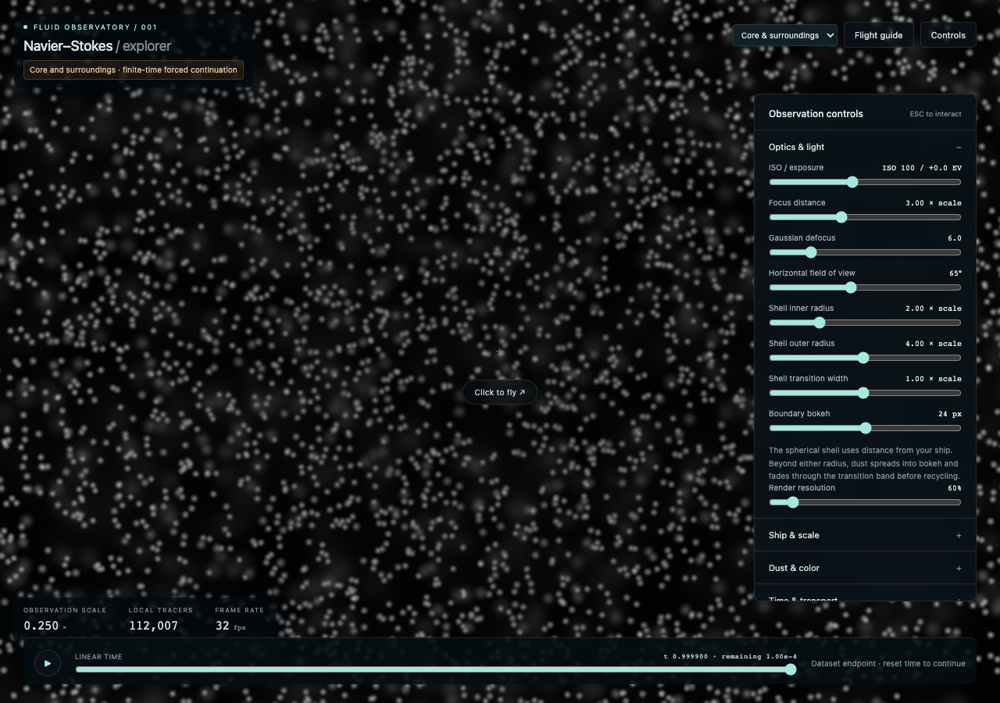

# Extended-field validation

The default field preserves the existing coupled core and supplies continuous
surroundings. Its precise scientific scope and equations are documented in
[extended-flow.md](../extended-flow.md). This is a finite forced approximation;
the full source construction and its smooth limiting force are not reproduced.

## Reproducible export

Run `npm run data:extended`. The September 9, 2026 run generated the
1,025 × 257 table in 53.4 seconds. The complete artifact inventory occupies
about 5.34 MB; gzip-compressed data chunks total 4.64 MB. Hosting must enable
compression to obtain the latter transfer size. No larger final run is needed
for this checkpoint.

The primitive has four channels: J, J_Y, J_eta, J_Yeta. A separate scalar table
contains the pressure-matched swirl. Both meridional velocity components are
derivatives of the same bicubic Hermite primitive. Swirl is bilinearly
interpolated; the exterior heat profile is evaluated from its scalar table.

The generator independently compares exported-field reconstruction against
analytic profiles at 170 queries, including the narrow B.22 continuation,
the pressure-matching annulus, and axial coordinates approaching ±1.

| Measurement | Result |
| --- | --- |
| Maximum velocity error / (1 + reference speed) | 0.00015471 |
| Maximum sampled divergence / (1 + gradient norm) | 5.43 × 10⁻⁹ |
| Browser reference positions | 21 |
| Axis primitive and its axial derivative | Exactly zero |
| Outer primitive and all exported derivatives | Exactly zero |
| Exported swirl | Positive throughout |

These are sampled numerical checks, not uniform error bounds. The generator
records complete measurements and force-refinement samples in
`web/public/datasets/extended-validation.json`; the manifest records hashes
and byte counts. Independent science tests also check the annular force,
radial pressure balance, the source continuation prescription, regular axis,
physical localization, and preservation of the previous core.

## Browser and particle checks

`web/tests/extended.spec.ts` checks the actual WebGL velocity against offline
references, including positions formerly excluded by the shrinking dataset.
It verifies that ordinary recycled particles are born with zero spatial
opacity and that a corrupted swirl chunk stops loading.

The complete synchronized time interval fits within 4,096 geometric transport
steps. Stationary ambient dust skips integration and retains its exact GPU
positions during playback, frozen-field transport, and transport overload.
The observation shell still retires particles that the spacecraft has left
behind.

An independent RK2 implementation checks twelve trajectories starting at
Y=8, 10, and 12, with eta=0 or .5, over both t=0→.9 and t=.9998→.9999.
Compared with quarter-sized steps, the default .0025-tau step has a maximum
final-position difference of 0.0412% and a maximum difference relative to
traveled distance of 0.0184%. Halving steps gives approximately fourfold
error reduction. These tests concern synchronized fluid-speed transport.

Pure heat-exterior trajectories retain radius and axial position. Their
angle uses eight-point Gauss quadrature in time; a frozen field uses an exact
rotation. Independent comparisons with 2,048-panel Simpson quadrature measure
relative angular error below 6×10⁻¹⁰ on the analytic test cases. The browser
test compares actual GPU trajectories with quadrature of the exported field.
Scientific samplers explicitly use high precision. The orbit rotation uses a
small-angle series and normalizes its sine/cosine pair to prevent radial
drift from GPU trigonometric approximation; the tested GPU position and
radius differences are below 10⁻⁶ physical units.

Existing regression tests preserve the isolated scientific checkpoints,
continuous shell transitions, and perspective brightness calibration.

Validation completed with `npm run build`, 52 Python science tests, and 15
relevant Playwright tests across the extended field, isolated core, transport,
recycling, and perspective calibration. The production smoke check loads the
static build beneath a repository URL prefix and exercises field switching.

The near-end view retains dust across the former cropped regions, with the
ship at its original position and scale:

