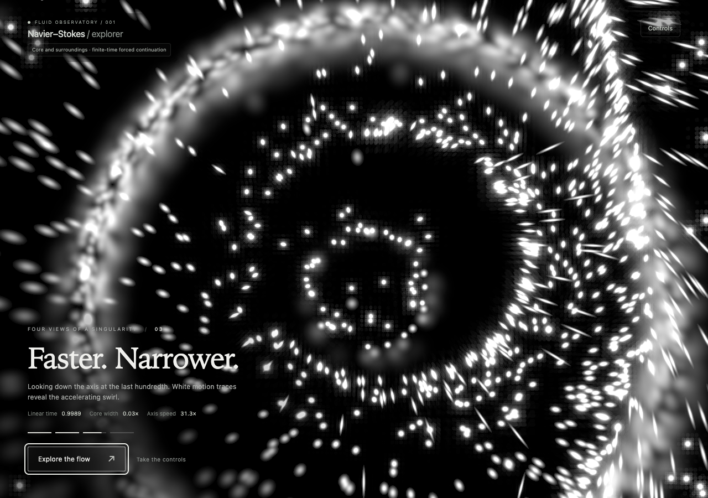

# Four views of the concentrating core

The arrival sequence is rendered live in WebGL, using the same precomputed
field and particle integrator as exploration. Its first cycle lasts **22
seconds**: four 5.5-second approaches, with fresh dust after each. Every
complete repeat halves playback speed again: 1×, ½×, ¼×, ⅛×, …, giving
cycle durations of 22, 44, 88, 176 seconds, etc. There is no fixed speed floor.
Camera paths, optical transitions, and physical time all share this clock.
The complete sequence uses **white light**. Temporary speed coloring and
distance desaturation were used only during visual composition.

| View | Starting time | Starting observation scale | Elevation |
| --- | --- | --- | --- |
| Drawn inward | 0 | 0.4 | 8° |
| Stretched upward | 0.9 | 0.1265 | 38° |
| Faster. Narrower. | 0.99 | 0.04 | 74° |
| Closer to infinity | 0.999 | 0.01265 | −28° |

On the first cycle, every view advances **linearly** to t=0.9999 over 4.5 seconds, after a
0.35-second fade-in. The endpoint is held briefly, then the image fades to
black for the next restart. Later views explicitly identify the shorter
physical interval. They are magnified replays, not four identical-duration
physical experiments. The renderer completes its initial GPU work before
starting the first shot's clock, so compilation does not skip the opening.

## Camera, depth, and light

Each camera orbits through 24° and gently changes elevation and roll. It
moves closer and reduces observation scale as the core contracts, with a
smooth floor that slows the camera near the endpoint. Physical contraction
continues faster than the camera zoom, keeping narrowing visible. Field of
view, focus, bokeh, and exposure follow small predetermined changes. These
are camera settings; the fluid velocity and the simulation clock retain
their scientific definitions.

Depth comes from parallax, focused luminous points, foreground/background
bokeh, and motion aligned with the actual projected fluid velocity. The
motion exposure uses an anisotropic Gaussian whose longitudinal variance
adds L²/12 for projected travel L. Dividing by both Gaussian widths preserves
integrated particle light. The straight-motion approximation is bounded to
2% of remaining physical time, with a 36-pixel travel cap. It neither emits
extra light when velocity rises nor draws artificial radial bursts.

The opening uses deliberately chosen ISO values; exposure does not adjust
automatically during manual exploration. **Explore the flow**, **Controls**,
Escape, or an input edit ends the choreography and preserves the current
camera and optics. The field pauses on handoff. **Replay sequence** starts
again at the original 1× speed. Users requesting reduced motion, `?intro=0`, and explicit isolated
field URLs start in manual mode.

## What the measurements mean

The core-width measure is sqrt((1−t)/(1−t_min)), the relative radial similarity
scale in the central plane. Axis speed is ((1−t_min)/(1−t))^(.5+h), the exact
relative velocity at the preserved core's origin. It is not the maximum
velocity anywhere in the surrounding field. These measures remain relative
to the dataset start, even when a later shot begins at higher magnification.

Captions describe contraction, axial stretching, and acceleration. The
scientific scope remains visible: this is the repository's finite forced
continuation, and the computed interval stops before t=1. The cinematic
presentation does not complete or validate the source's remaining matching
and correction construction.

## Hidden replenishment

Visible dust still follows the computed velocity. To keep the local sampling
pool useful, ordinary replacement proposals now sample the optical support
surfaces by area and weight them by inward flux relative to the translating
and scaling observer. The radius changes with the observation scale. A
12-candidate reservoir approximates this boundary distribution; it is not
a proof of exact uniform tracer density.

Births lie strictly on the invisible side of the shell. Existing incoming
dust uses the continuous spatial fade; applying another age fade would
artificially dim fast crossings. Explicit resets and initial populations
retain their temporal fade. Outgoing invisible guard particles are retired,
and failed incoming proposals leave an inactive slot to retry. Stationary
dust already in view keeps its position.

## Checks

- A real-time Playwright run observes all four shots and the restart after
  22 seconds, with finite particle state and white rendering.
- Clock checks cover the four physical intervals and changing camera/optics,
  the boundaries of five progressively slower cycles, and identical
  compositions at corresponding moments. The real-time run checks the
  transition to ½ speed and Replay resetting to 1×.
- Interaction checks cover keyboard handoff, controls, replay, and reduced
  motion; editing an input preserves the user's new value.
- GPU integration of both circular and directional Gaussian footprints
  preserves particle light within 2% in the tested finite pixel fixture.
- Analytic inflow tests cover constant-flow sphere flux, incompressible
  strain, a moving observer, stationary fluid, and translation invariance.
- Existing surrounding-field, stationary-dust, recycling, and perspective
  calibration checks remain part of the regression suite.

Validation: production build, 52 scientific tests, and 17 relevant browser
checks passed. The production smoke run observed all four views and the
restart, verified white light and finite GPU state, then handed control to
the explorer and switched scientific fields under a repository URL prefix.

