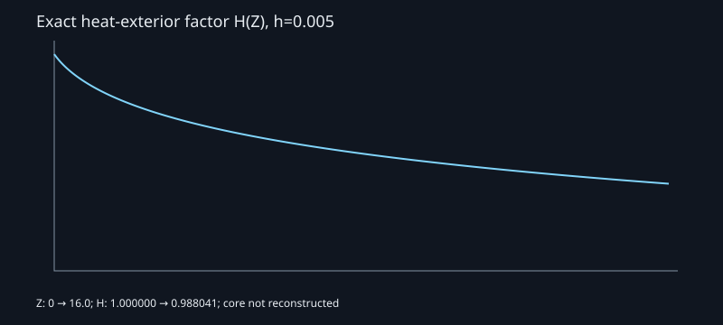

# Heat-exterior numerical validation

Configuration: [preview.json](../../science/configs/preview.json). Scope and formulas: [mathematics.md](../mathematics.md). Machine-readable latest measurements: [science-preview.json](science-preview.json).

The generator compares lookup interpolation with independent doubled-quadrature evaluations at 256 fixed off-grid arguments. The same query points are used at each resolution, with extra concentration near zero where curvature is largest.

| H table entries | Maximum measured absolute interpolation error |
| --- | --- |
| 513 | 1.12 × 10⁻⁶ |
| 1,025 | 2.93 × 10⁻⁷ |
| 2,049 | 7.25 × 10⁻⁸ |

The reduction is consistent with second-order linear interpolation. Float32 storage plus interpolation gives maximum absolute error **8.09 × 10⁻⁸**, below the initial release threshold `1e-6`. Since `H` remains close to one here, this also bounds the sampled relative velocity error to roughly `1e-7` at those tested arguments. It does not measure GPU arithmetic or all possible arguments; browser comparisons must assess that separately.

The doubled-quadrature maximum difference was `1.11e-16`. Direct integral derivative evaluation gives a maximum scalar heat-equation residual of `2.60e-18` on seven selected arguments. Agreement at roundoff is empirical evidence, not a rigorous error bound.

Eight Python tests check gamma-moment endpoint derivatives, convergence of the **physical-coordinate** heat equation under finite-difference refinement, Cartesian incompressibility, rotation covariance, pressure/centripetal balance, invalid-axis handling, similarity-coordinate inversion, Appendix B's scalar bound, and dataset integrity/coverage (several assertions share a test).

Generated manifest, table, and optional Cartesian reference fixture occupy approximately **54 KB** without compression; initial generation measured **0.20 seconds**. Runtime metadata can vary between runs; the field chunk itself is deterministic on the same numerical platform. This quick exterior checkpoint should not be used to estimate the unresolved full core construction's cost.

No result here validates the full blowup solution, startup from rest, core matching, or total kinetic energy. No final one-hour computation has been attempted.
